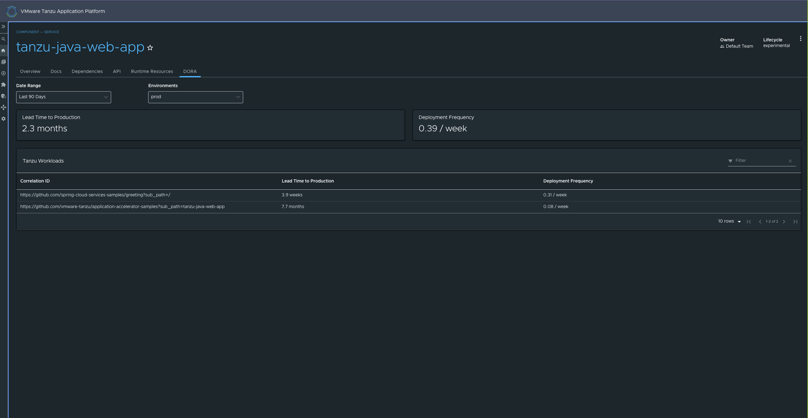

# DORA metrics in Tanzu Developer Portal

This topic tells you about viewing DevOps Research and Assessment (DORA) metrics in Tanzu Developer
Portal.

##  Overview

DORA is a research program for studying the capabilities that drive software delivery and operations
performance. DORA helps teams apply these capabilities to improve organizational performance.
For more information about DORA, see the [DORA website](https://dora.dev/).

DORA metrics are a set of key performance indicators (KPIs) that DORA has developed to measure the
effectiveness of an organization's DevOps practices. These metrics help organizations to assess
their software development and delivery processes and identify areas for improvement.

Collecting DORA metrics can be challenging because it involves:

- Gathering data from various sources and tools
- Ensuring data accuracy and consistency
- Dealing with organizational and cultural resistance to measurement and improvement

Tanzu Application Platform is uniquely positioned to provide DORA metrics through its integrated
supply chain. This supply chain offers end-to-end visibility and control over the entire development
and deployment process, enabling comprehensive measurement and optimization of DevOps practices.

##  DORA metrics

DORA metrics include:

- Deployment Frequency, which measures how often code changes are deployed to an environment. High
  deployment frequency is often associated with a mature DevOps culture.

- Lead Time for Changes, which measures the time it takes to go from code committed to code
  successfully running in an environment. Shortening this lead time is often a goal of DevOps
  practices.

- Change Failure Rate, which measures the rate at which changes to the production environment cause
  failures or incidents. Lower failure rates indicate a reliable software delivery process.

- Mean Time to Recovery (MTTR), which measures how quickly an organization can recover from
  incidents or outages in production. A lower MTTR suggests that an organization resolves issues
  quickly.

##  Supported DORA metrics

This table shows supported DORA metrics in the Tanzu Application Platform v{{ vars.tap_version }}
DORA plug-in. Support for more metrics is planned for later DORA plug-in versions.

| DORA metric           | Tanzu Application Platform v{{ vars.tap_version }} DORA plug-in support |
|-----------------------|-------------------------------------------------------------------------|
| Deployment Frequency  | Yes                                                                     |
| Lead Time for Changes | Yes                                                                     |
| Change Failure Rate   | No                                                                      |
| Mean Time to Recovery | No                                                                      |

##  Use the DORA plug-in

To use the DORA plug-in:

1. Use an authentication provider to log in to Tanzu Developer Portal. You cannot see DORA metrics
   if you use guest access.

2. Select the component you want to view DORA metrics for.

3. Click the **DORA** tab in the navigation list.

##  DORA metric calculation

By default, DORA metrics are calculated from the average number of deployments to all environments
in the last 90 days. Two filtering options are available from drop-down menus:

- By date range, based on a predefined set of choices
- By environment, based on the location labels configured by a platform engineer

For more information about location configuration, see
[Configure Artifact Metadata Repository](../../scst-store/amr/configuration.hbs.md).

Tanzu workloads have a correlation ID that groups all of the artifacts together.

